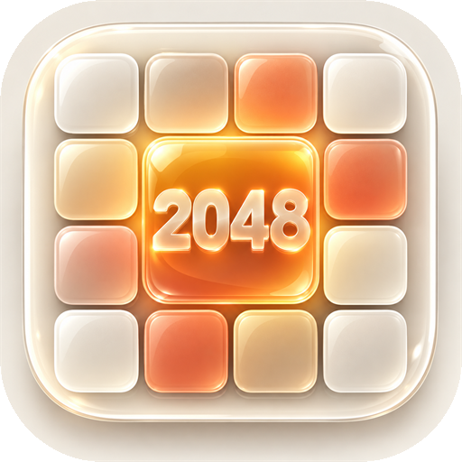

<p align="center">
  
</p>

# 2048 Studio

A polished, local-first 2048 game built with TypeScript and Vite. No backend, no accounts, no tracking — the full game runs in the browser, works offline once installed, and saves progress to `localStorage`.

> **Source of truth:** this README describes only what is implemented in the codebase (`src/`, `public/`, `tests/`, configs). Anything not listed here is not part of the app.

## Features

- Classic 4×4 2048: slide, merge equal tiles, spawn 2s (90%) and 4s (10%)
- Win detection at 2048 with a “Keep going” continue option; game-over detection with restart
- Score + best score, with a score-pop animation on merges
- Statistics dialog: current score, best score, moves this game, merges this game, highest tile
- Settings dialog: theme picker shortcut and light/dark appearance toggle
- Five switchable themes (see below), each with its own motion timing, tile styling, and shell effects
- Light/dark appearance for every theme (Modern is dark-first, the rest are light-first)
- Keyboard input (arrow keys + WASD) and pointer swipe (touch and mouse drag, 24 px threshold)
- Automatic saving to `localStorage` on every action and on background/page-hide; corrupt saves are discarded and a fresh game starts
- Installable PWA: web manifest, PNG icons derived from `logo.png` (192/512/maskable, plus Apple touch icon and favicon), and an offline-first service worker (production builds only)
- Accessibility: ARIA grid labeling with a per-tile board summary, live-region status announcements, keyboard focus restore after dialogs, visible focus outlines, and `prefers-reduced-motion` support

## Themes

All themes are defined in `src/themes/` and implement the same `ThemeDefinition` contract (label, composition classes, typography tokens, icon glyphs, motion timings, tile class mapping, shell composition).

| Theme | Label | Note | Move / Merge / Spawn | Easing |
|---|---|---|---|---|
| `apple` (default) | Apple | Quietly refined | 180 / 220 / 180 ms | `cubic-bezier(.2,.8,.2,1)` |
| `glass` | Liquid Glass | Light in motion | 190 / 260 / 220 ms | `cubic-bezier(.32,.72,.24,1.15)` |
| `material` | Material | Structured energy | 200 / 240 / 180 ms | `cubic-bezier(.2,0,0,1)` |
| `oldschool` | Oldschool | Classic arcade | 120 / 140 / 100 ms | `steps(3,end)` |
| `modern` | Modern | Boldly minimal | 160 / 190 / 150 ms | `cubic-bezier(.22,1,.36,1)` |

Visual notes (from `src/styles.css`):

- **Apple:** soft light surfaces with warm orange accents; blurred ambient orbs.
- **Liquid Glass:** frosted-glass panels (`backdrop-filter` blur + saturate), aurora gradient, film grain, specular tile highlights.
- **Material:** Material-3-like purple (`#6750a4`), compact radii, elevated cards.
- **Oldschool:** CRT arcade look — monospace type, hard offset shadows, scanlines, vignette, dot-matrix texture; merge animation uses its own keyframes.
- **Modern:** dark-first editorial style with lime accent (`#d7f36a`) and a fading blueprint grid; flat tiles with a glow on 1024+.

Tiles valued above 2048 share a single `super` style bucket in every theme.

## iOS-first / PWA approach

- `viewport-fit=cover` with `env(safe-area-inset-*)` padding, so the layout respects notches and home indicators
- Apple-specific meta tags (`apple-mobile-web-app-capable`, status-bar style, app title) and an `apple-touch-icon`
- `visualViewport`-based `--visual-viewport-height` plus an orientation dataset, keeping the board sized correctly when browser chrome shows/hides or the device rotates
- Standalone detection (`display-mode: standalone` + iOS `navigator.standalone`) stored in app state
- `touch-action: none` on the board for reliable swipe handling; 44 px icon buttons as touch targets
- Manifest (`public/manifest.webmanifest`): `display: standalone`, `orientation: portrait`, PNG icons (`icon-192.png`, `icon-512.png`, `icon-maskable.png`) derived from `logo.png`
- Service worker (`public/sw.js`, cache `2048-studio-v3`): precaches the shell, manifest, icons, and parsed `/assets` bundles; navigations are network-first with an `index.html` fallback; other GETs are cache-first with runtime caching. It registers **only in production builds**; development builds unregister service workers and clear app caches instead.
- Lifecycle handling: hiding the page or navigating away cancels the active gesture/animation and persists immediately; returning to the page persists again.

## Offline / local functionality

- 100% client-side: no network calls, no backend, no analytics
- Single save slot in `localStorage` under key `2048-studio-save`, schema version `1`
- Saved: board state (tiles, score, status, continued flag, id counter), best score, theme, dark mode
- **Not** saved: session move/merge counters (reset on reload), animation state
- Saves are strictly validated (16 cells, power-of-two tile values, unique ids/positions, `best >= score`, known theme); anything invalid is removed and the app starts fresh

## Architecture

Runtime flow:

```
startup (main.ts) → app state + commands (AppController)
  → game core (pure move/spawn/score logic + MoveTransition)
  → rendering / animation (BoardRenderer + AnimationCoordinator)
  → themes (registry + CSS layers) → persistence (localStorage)
  → platform / PWA (viewport, lifecycle, service worker)
```

Details live in [`docs/architecture.md`](docs/architecture.md). Module map:

| Area | Location |
|---|---|
| Startup / shell / dialogs | `src/main.ts` |
| App state / commands | `src/app/{state,commands,controller}.ts` |
| Game core (rules, spawning, scoring) | `src/core/game.ts` |
| Input (keyboard + swipe) | `src/input/controller.ts` |
| Rendering / animation | `src/render/{board,animation}.ts` |
| Themes | `src/themes/` (`registry`, `types`, `composition`, five theme modules) |
| Persistence | `src/persistence/{storage,schema}.ts` |
| Platform / PWA | `src/platform/{viewport,lifecycle,pwa}.ts` |
| Styles (all themes) | `src/styles.css` |
| PWA assets | `public/{manifest.webmanifest,sw.js,logo.png,icon-*.png,apple-touch-icon.png,favicon-32.png}` |
| Tests | `tests/{game,persistence}.test.ts` |

## Setup

Requirements: Node.js with npm (verified with Node v26.1.0 / npm 11.14.1).

```bash
npm install
npm run dev      # start dev server (http://localhost:5173, listens on 0.0.0.0)
```

## Scripts

All scripts below exist in `package.json`:

| Script | Command | Purpose |
|---|---|---|
| `npm run dev` | `vite` | Local dev server on port 5173 |
| `npm run build` | `tsc --noEmit && vite build` | Type-check, then production build into `dist/` |
| `npm test` | `vitest run` | Run the test suite once |
| `npm run preview` | `vite preview` | Serve the production `dist/` build locally |

## Testing

```bash
npm test
```

Vitest, 9 tests in 2 files — all passing:

- `tests/game.test.ts` (6 tests): merge-once-per-pair with stable result identity, all four move directions, chained-merge ordering, blocked moves returning identical state, game-over detection on a full blocked board, 2048 win → moves rejected until `continueGame`
- `tests/persistence.test.ts` (3 tests): valid save round-trips through the schema, corrupt scores / non-power-of-two tiles rejected, unknown versions and null migrate to `null`

## Build

```bash
npm run build
```

Runs `tsc --noEmit` first, so type errors fail the build. Output goes to `dist/` (generated; not tracked in git). Verified output: `index.html`, hashed JS/CSS under `dist/assets/`, plus copied PWA files (`sw.js`, manifest, icons).

## Limitations / real-device validation

- **Not yet validated on real devices.** The following are implemented but need physical iPhone/iPad/Android testing: home-screen install flow, standalone launch, swipe feel and the 24 px threshold, safe-area layout with real notches, service-worker update behavior across versions, and animation smoothness (especially the Glass aurora/grain and Oldschool CRT layers on low-end GPUs).
- Production service-worker updates intentionally wait instead of interrupting active gameplay.
- One save slot only; no profiles, undo, hints, or leaderboards.
- Session stats (moves/merges) reset on reload; they are not persisted.
- The win overlay triggers once per game (a `continued` flag gates it); tiles above 2048 share one style bucket.
- `prefers-reduced-motion` collapses animations to near-instant; theme motion timings otherwise differ per theme (see table).
- Dev dependencies are unpinned (`latest`); run `npm install` output review is advised before releases.

## Deployment (GitHub Pages)

The app is a fully client-side static PWA deployed to:

- Site: <https://crzx1337.github.io/2048-site-modern/>
- Repository: <https://github.com/CRZX1337/2048-site-modern>

How it works:

- `vite.config.ts` sets `base: '/2048-site-modern/'`, so every generated asset URL carries the repository subpath. The app never assumes it is hosted at `/`.
- `.github/workflows/deploy.yml` runs on pushes to `main` (and manually via `workflow_dispatch`): `npm ci` → `npm test` → `npm run build` → upload `dist/` → deploy with the official `deploy-pages` action. Test or build failures stop the workflow before anything is deployed.
- PWA files are subpath-aware: the manifest uses `/2048-site-modern/` for `start_url`, `scope`, and icons; the service worker derives its base from its own registration scope and caches the subpathed shell, manifest, icons, and `/assets` bundles; registration uses `import.meta.env.BASE_URL` (`src/platform/pwa.ts`).
- `public/.nojekyll` is shipped so GitHub Pages serves all built files as-is.

Manual setup still required once in GitHub: repository **Settings → Pages → Build and deployment → Source: GitHub Actions**.

## GitHub

- Repository: <https://github.com/CRZX1337/2048-site-modern>
- Live site: <https://crzx1337.github.io/2048-site-modern/>

## License

No license file is currently present in the repository. All rights reserved by default until one is added.
